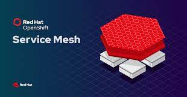

# Service Mesh HOW-TOs

This repository contains the accompanying source code for my Red Hat OpenShift Service Mesh video series on Youtube. Each subfolder deals with a particular Service Mesh topic. More topics will be added when new videos are published.

   

You can watch the introduction video here. The video answers the question why Service Mesh and gives a brief architecture overview of Service Mesh.

  

For a particular topic eg, mTLS (Mutual TLS) security, please go to that subfolder. There will be a README.md file to describe what is on offer and a link to my Youtube video on the subject. The folder also contains all the source code used in the demo. 

 

Enjoy!
