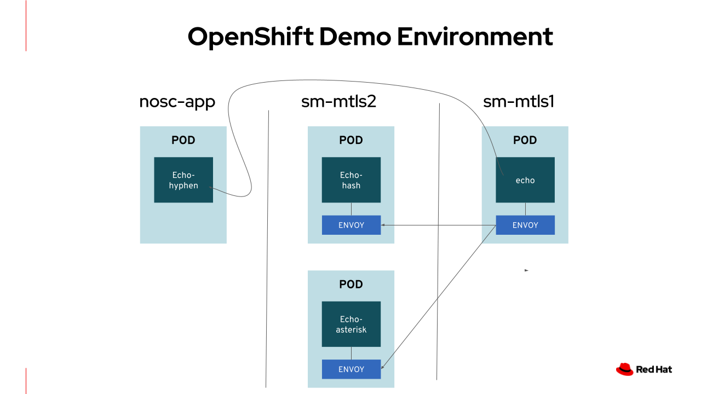
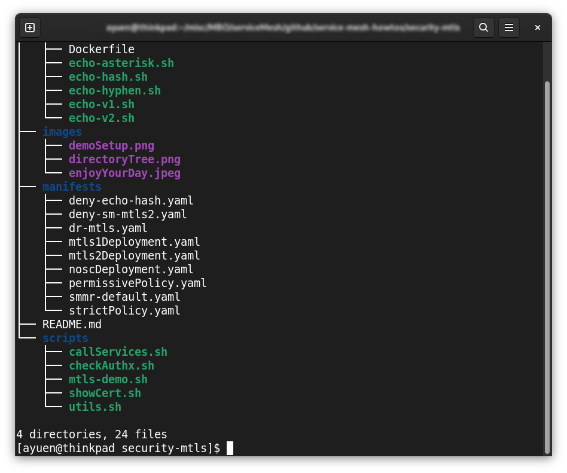

# Service Security Using mTLS
You can watch this video here:

 

## 1 Service Mesh Security Features

* Identity and certificate management
    - provisions strong identities to every workload with X.509 certificates
     - automate key and certificate rotation at scale

* Authentication
    - Peer authentication
    - Request authentication

* Authorisation
    - provide mesh-, namespace-, and workload-wide access control for your workloads in the mesh

Note: Request authentication will be discussed in another video.

In order not to introduce too many new things all at once, I am limiting the discussion to the following CRDs (Custome Resource Definitions) to adminster security policies. They are:
* The **DestinationRule** (DR) CRD configures how an Envoy proxy sends origin requests.
* The **PeerAuthentication** (PA) CRD configures the policies for receiving requests.
* The **AuthorizationPolicy** CRD supports CUSTOM, DENY and ALLOW actions for access control.

Other topics like gateways, virtualservice, etc. will be introduced in subsequent videos.

## 2 What you can expect from the Demo
The demo environment is as follows:

There are 3 projects (namespaces):
1. Project **sm-mtls1** consists of a simple echo service. You send it a text message, it echoes the message back unmodified.  I am too lazy to write such an application in Java or any other programming language. Instead, I implemented the echo service using the netcat linux command. 
2. Project **sm-mtls2** consists of 2 echo services. When you send them a text message, one will send the message back with all spaces replaced by hashes and another one with asterisks. 
3. Project **nosc-app** (no-side-car-app) consists of just 1 echo service which replaces all spaces with hyphens. 

All the 3 projects are in the Service Mesh by adding them to the SMMR (Service Mesh Member Roll) which you will see in the demo. I do this so that I do not have to introduce additional concepts including Ingress, Egress, Virtualservice, etc., which complicates the scenario. They will be covered in subsequent videos. The echo service in the nosc-app project does not have an Envoy side-car, unlike the ones in the other projects. This means that it cannot use mTLS to communicate with other services. It will uses clear text communication.

It is best to watch the demo video to see the behaviour changes after administering each security policy.
  
## 3 For Those Who Want to Reproduce the Demo
I have encapsulated the demo in a shell script. You can run the same shell script that I ran in the demo video to reproduce what you've seen. Before getting into that, let me tell you about the directory structure of this repository.

 
Directories:
* docker - contains a Dockerfile and some shell scripts used in creating the echo service image for the demo. You can build the image yourself or just use my image at:

<pre>
quay.io/andyyuen/easyecho:latest
</pre>
* images - contains the images used in this README.md file.
* manifests - contains all security policies and deployment yaml files used in the demo
* scripts - contains all the shell scripts used in the demo. The main scipt to start the demo is **mtls-demo.sh** which sources/calls other scripts.

To run the mtls-demo.sh script, your OpenShift environment must satisfy the following prerequsites:
* Service Mesh must have been installed. There will be, if not already there, a how-to on Service Mesh installation,
* your project that serves as the global control plane for Service Mesh is named **istio-system**, Again, you can see this in the Service Mesh installation how-to

And on your Linux workstation:
* oc command installed
* yq command installed. If your Linux repositories do not contain the yq command, you can install it by running:
<pre>
sudo wget -qO /usr/local/bin/yq https://github.com/mikefarah/yq/releases/latest/download/yq_linux_amd64
sudo chmod a+x /usr/local/bin/yq
</pre>

* log in to your OpenShift instance using the oc command
* change to the 'scripts' directory

And run the demo script:
<pre>
./mtls-demo.sh
</pre>

  
That's all folks!
